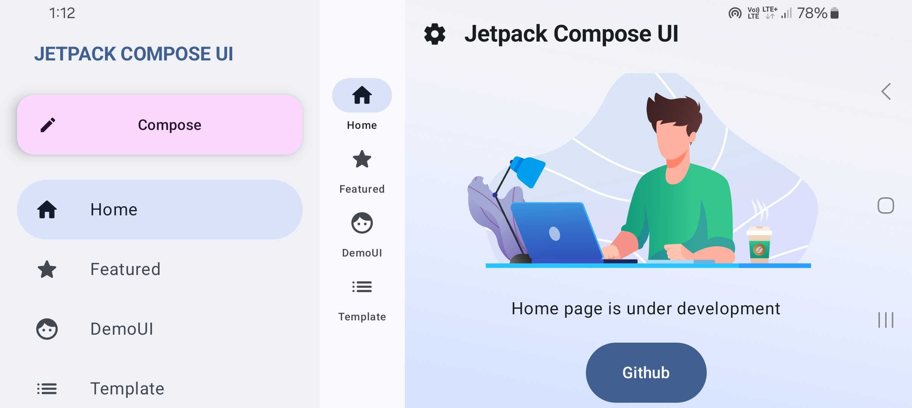
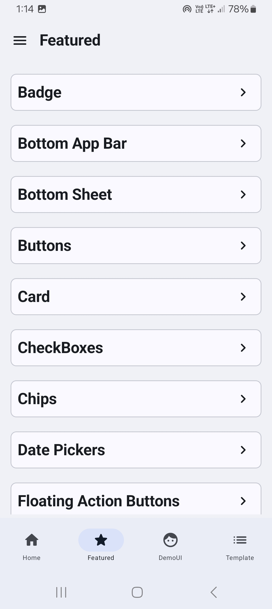
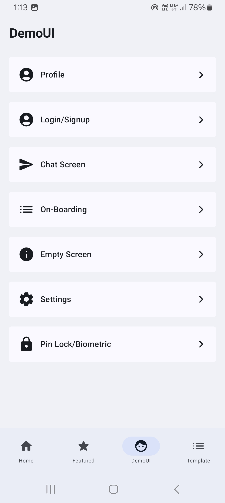
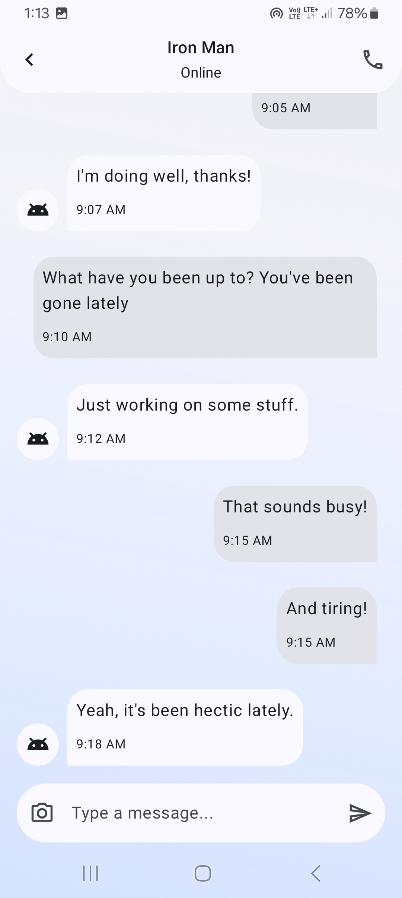
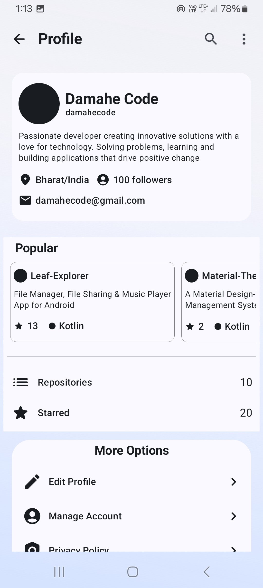
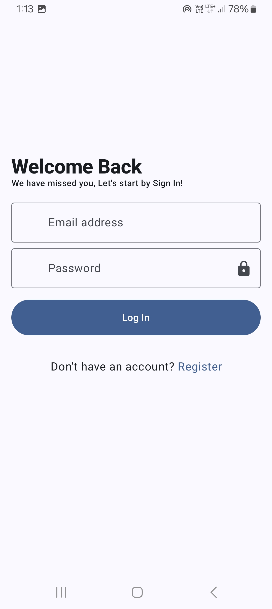
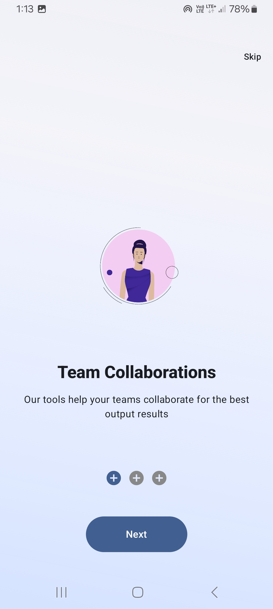

<!-- MARKDOWN LINKS -->
<!-- https://www.markdownguide.org/basic-syntax/#reference-style-links -->
[contributors-shield]: https://img.shields.io/github/contributors/damahecode/Jetpack-Compose-UI.svg?style=for-the-badge
[contributors-url]: https://github.com/damahecode/Jetpack-Compose-UI/graphs/contributors
[forks-shield]: https://img.shields.io/github/forks/damahecode/Jetpack-Compose-UI.svg?style=for-the-badge
[forks-url]: https://github.com/damahecode/Jetpack-Compose-UI/network/members
[stars-shield]: https://img.shields.io/github/stars/damahecode/Jetpack-Compose-UI.svg?style=for-the-badge
[stars-url]: https://github.com/damahecode/Jetpack-Compose-UI/stargazers
[issues-shield]: https://img.shields.io/github/issues/damahecode/Jetpack-Compose-UI.svg?style=for-the-badge
[issues-url]: https://github.com/damahecode/Jetpack-Compose-UI/issues
[license-shield]: https://img.shields.io/github/license/damahecode/Jetpack-Compose-UI.svg?style=for-the-badge
[license-url]: https://github.com/damahecode/Jetpack-Compose-UI/blob/master/LICENSE

[![Contributors][contributors-shield]][contributors-url]
[![Forks][forks-shield]][forks-url]
[![Stargazers][stars-shield]][stars-url]
[![Issues][issues-shield]][issues-url]
[![MIT License][license-shield]][license-url]

# Jetpack Compose UI by Damahe Code
A Collection on all Jetpack compose UI Layouts, Demo screens to see it's potential

## Requirements
- Android Studio Flamingo or later

## App Demo
[Google Play Store](https://play.google.com/store/apps/details?id=com.code.damahe.jetpack.compose.ui)

## Features
* Material Design 3 theme and components
* Material You dynamic color and Light/Dark theme support
* Integration with Architecture Components, Navigation, ViewModel

- [x] Badge
- [x] Bottom App Bar
- [x] Bottom Sheet
- [x] Buttons
- [x] Card
- [x] Checkboxes
- [x] Chips
- [x] Date Pickers
- [x] Floating Action Buttons
- [x] Icon Buttons
- [x] Lists
- [x] Menus
- [x] Navigation bar
- [x] Navigation rail
- [x] Radio buttons
- [x] Segmented button
- [x] Switches

```more features coming soon```

## Screenshots

|  |
|:-----------------------------------------------------------------:|
|                         Responsive Screen                         |

|  |  |
|:--------------------------------------------------------:|:-------------------------------------------------------:|
|                         Featured                         |                         Demo UI                         |

|  |  |
|:----------------------------------------------------:|:-------------------------------------------------------:|
|                     Chat Screen                      |                     Profile Screen                      |

|  |  |
|:-----------------------------------------------------:|:-----------------------------------------------------------:|
|                     Login Screen                      |                     On-Boarding Screen                      |


